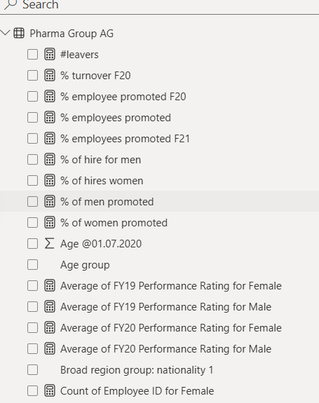

# PWC-INCLUSION-AND-DIVERSITY ANALYSIS
This dataset provides comprehensive insights into inclusion and diversity (I&amp;D) metrics across organizations, industries, and regions. It is designed to help researchers, policymakers, and businesses analyze trends, measure progress, and identify areas for improvement in fostering inclusive and diverse workplaces.

# Problem Statement
1) Define relevant KPIs in hiring, promotion, performance and turnover, 
2) Create a visualisation for the HR manager that reflects all relevant Key Performance indicators(KPIs) and metrics in the dataset.

Calculating the following measures could help to define proper KPIs:
1) Number of men
2) Number of women
3) Number of leavers
4) % employees promoted (FY21)
5) % of women promoted
6) % of hires men
7) % of hires women
8) % turnover
9) Average performance rating: men
10) Average Performance rating: women

# Datasource
Dataset used for this task was presented by Pwc and Diversity and Inclusion dataset:
Dataset: Diversity and Inclusion

# Data Preparation
The Data transformation was completed in Power Query and the dataset loaded into Microsoft Power BI Desktop for modeling.
1) The dataset named Diversity and inclusion dataset has 500 rows and 31 column of observation
2) Removed Unnecessary columns
3) Removed Unnecessary rows
4) Each of the columns in the table were validated to have the correct data type

# Data Modelling
After cleaning and transformation of the data, the next step is data modelling:

# Data Analysis (DAX)
Measures used in the visualization includes:
- #leavers = CALCULATE(COUNTA('Pharma Group AG'[Employee ID]),'Pharma Group AG'[Leaver FY] IN {"FY20"})
  
- %  turnover F20 = ([Count of FY20 leaver? for Yes]/[total number of employee])
  
- % employees promoted F21 = [Count of Promotion in FY21? for Yes]/[total number of employee]
  
- % of hire for men = ([Count of New hire FY20? for Male]/[Total no. of hired workers])
  
- % of hires women = ([Count of New hire FY20? for Female]/[Total no. of hired workers])
  
- % of men promoted = ([Count of Promotion in FY21? for Yes for Male]/[Total promoted F21])
  
- % of women promoted = ([Count of Promotion in FY21? for Yes for Female]/[Total promoted F21])
  
- Average of FY20 Performance Rating for Female = CALCULATE(AVERAGE('Pharma Group AG'[FY20 Performance Rating]),
	'Pharma Group AG'[Gender] IN { "Female" })

- Average of FY20 Performance Rating for Male = CALCULATE(AVERAGE('Pharma Group AG'[FY20 Performance Rating]),
	'Pharma Group AG'[Gender] IN { "Male" })

# Data Visualization
Data visualization for the data analysis (DAX) was done using Microsoft Power BI;

The report consists of 3 pages:
- The HR
- Gender roles
- Insights

This shows visualization from diversity and inclusion:

## HR PAGE

 

